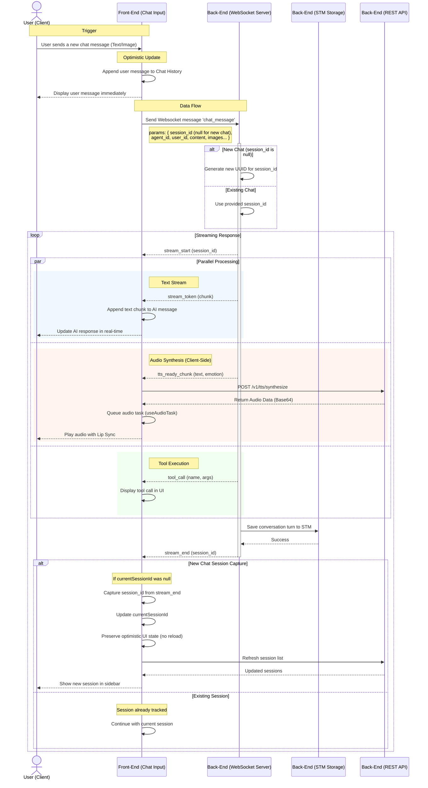

# ADD_CHAT_MESSAGE Data Flow

## Session Persistence Flow

### Correct Flow

1. **User clicks a session in the sidebar** → Load that session's history from STM and draw the chat_history to UI.

2. **User sends a message** → Should be stored to the currently selected session_id
   - Saving logic handled by backend. FE only handles `session_id` for that.
   - When `session_id` is null → backend perceives that as new chat.
   - When `session_id` is not null → backend perceives that as existing chat.

3. **When creating a new chat**, `session_id` starts as null, backend generates UUID, and frontend captures it from `stream_end` event.

## DATA FLOW DIAGRAM

## Detailed Point about Audio Synthesis

1. **Trigger**: Backend analyzes the stream and determines a complete sentence/phrase is ready for speech.
2. **Notification**: Backend sends `tts_ready_chunk` WebSocket message containing **text** and optional **emotion**.
3. **Synthesis**: Frontend (`useAudioTask`) receives the message and immediately calls `POST /v1/tts/synthesize` to convert the text chunk to audio.
4. **Queueing**: The resulting audio is added to a sequential task queue (`audioTaskQueue`).
5. **Playback**: Audio is played in order, synchronized with Live2D lip-sync movements.

## Key Implementation Details

### Session ID Capture Logic

- **New Chat**: When `session_id` is `null`, backend generates a UUID and returns it in the `stream_end` event.
- **Frontend Capture**: Frontend checks if `currentSessionId` is null in the `stream_end` handler. If so, it captures and stores the backend-generated UUID.
- **Optimistic UI Preservation**: The context prevents reloading messages when transitioning from `null` → UUID to avoid UI flicker.
- **Subsequent Messages**: Next message uses the captured `session_id`, ensuring all messages belong to the same session.

### STM Persistence

- Backend automatically saves both user and assistant messages to STM (Short Term Memory) when processing completes.
- Frontend does not directly call STM APIs for saving; it only reads history when loading sessions.
- Session persistence is guaranteed by the backend's `stream_end` logic.

## Appendix

- [WebSocket Service](../../feature/service/websocket-service.md)
- [API Service](../../feature/service/api-service.md)
- [Backend WebSocket API](../../../../backend/docs/websocket/WEBSOCKET_API_GUIDE.md)
- [TTS Synthesize API](../../../../backend/docs/api/TTS_Synthesize.md)
- [useAudioTask Hook](../../feature/hook/utils.md)
