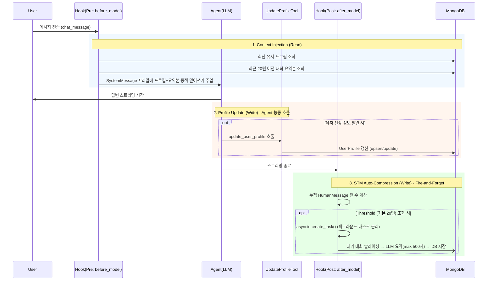

# Context Injection & Auto-Compression Flow

Updated: 2026-04-17

## 1. Synopsis

- **Purpose**: 동적 컨텍스트(User Profile) 주입 및 대화 턴 수 기반의 STM 자동 압축(Summarization) 사이클
- **I/O**: LangGraph Middleware (Pre/Post hooks) ↔ MongoDB (UserProfile, ConversationSummary)
- **핵심**: 유저 프로필 갱신은 Agent의 능동적 도구 호출로, 대화 요약은 턴 수 기반의 Fire-and-Forget 백그라운드 태스크로 처리하여 응답 지연을 방지.

## 2. Core Logic & Data Flow



### 2-1. Configuration & Tweak Points

이 로직들에 대한 설정값 및 동작 방식은 다음 위치에서 수정할 수 있습니다.

| 설정 항목 | 현재 기본값 | 수정 위치 (파일 경로) | 설명 |
|-----------|-------------|-----------------------|------|
| **요약 실행 임계값** | `20` 턴 | `.env`의 `SUMMARY_TURN_THRESHOLD` 변수<br>(또는 `src/services/agent_service/middleware/summary_middleware.py`) | 누적된 턴 수(`HumanMessage` 갯수)가 이 값을 초과할 때마다 백그라운드 요약 실행 |
| **요약 최대 길이** | `500` 단어 | `src/services/summary_service/service.py` 내 `_DEFAULT_MAX_SUMMARY_LENGTH` | 내부 LLM이 생성하는 요약본의 목표 최대 단어 수 |
| **요약 주입 구분자** | `\n\nPrevious Conversation Summary:` | `src/services/agent_service/middleware/summary_middleware.py` 내 `_SUMMARY_SECTION_HEADER` | SystemMessage 내에서 요약본을 찾아 치환할 때 사용하는 고정 문자열. **임의 변경 시 치환 버그 발생 주의** |
| **프로필 주입 구분자** | `\n\nUser Profile:` | `src/services/agent_service/middleware/profile_middleware.py` 내 `_PROFILE_SECTION_HEADER` | SystemMessage 내에서 프로필을 찾아 치환할 때 사용하는 고정 문자열. |

### Middleware Chain Order

```
ToolGate → HitL → Delegate → Profile → Summary → LTM → TaskStatus
```

- **HitLMiddleware** (PR #36 → Phase 2 #42): ToolGate 다음 2번째 위치. `_DEFAULT_CATEGORIES` + YAML override로 빌드된 category_map 기준으로 `read_only` 바이패스, 그 외(`state_mutating`/`external`/`dangerous`)는 `interrupt()`로 FE 승인 게이트. Interrupt payload에 `category` 포함.

### 2-2. 제약 및 주의 사항 (Constraints)

- **문자열 치환 기반 주입**: Pre-hook은 `SystemMessage` 내에서 `_SUMMARY_SECTION_HEADER`와 `_PROFILE_SECTION_HEADER`를 `.split()`으로 찾아 텍스트를 통째로 교체합니다. **이 구분자 문자열을 함부로 수정하면 중복 주입되거나 주입이 누락되는 치명적 버그가 발생합니다.**
- **Fire-and-Forget 요약**: 요약 태스크는 `asyncio.create_task()`로 던져지므로, 요약 중 타임아웃(60초)이나 에러가 발생해도 Agent의 응답은 정상적으로 나갑니다. 요약 에러는 `logger.error` 서버 로그로만 남습니다.
- **프로필 업데이트는 LLM 의존**: 프로필 정보 갱신은 전적으로 LLM이 `update_user_profile` 툴을 스스로 호출해야만 일어납니다. 프롬프트나 페르소나 설정에 따라 툴 호출 빈도나 정확도가 달라질 수 있습니다.

## 3. Usage

- 시스템 레벨에서 100% 자동화되어 있으므로 외부 클라이언트(FE)가 별도로 호출할 API는 없습니다.
- **개발 환경 테스트**: 임계값을 줄여 테스트하려면 `.env`에 `SUMMARY_TURN_THRESHOLD=2` 등으로 설정하고 대화를 3턴 이상 이어가면 서버 로그(`Summary generated for session...`)를 통해 백그라운드 압축이 동작하는 것을 확인할 수 있습니다.
