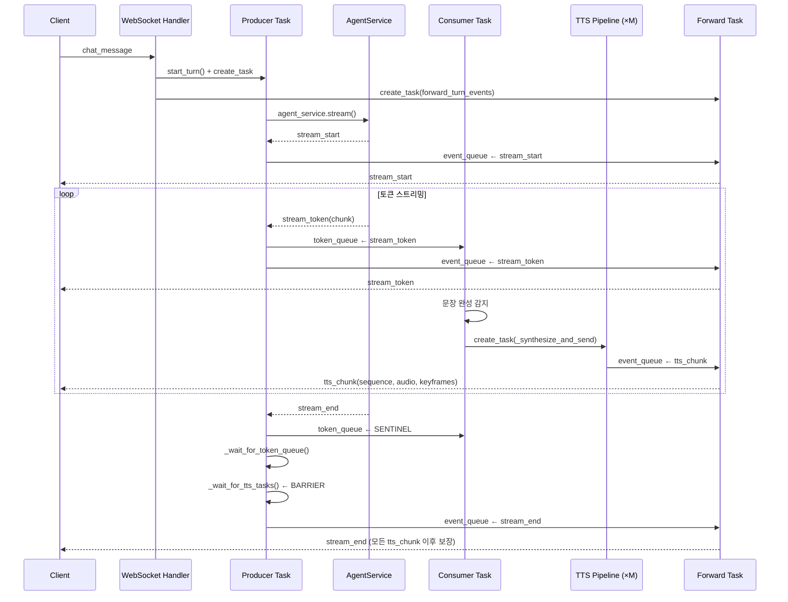

# STREAM_TOKEN / TTS_CHUNK Data Flow

Updated: 2026-04-08

## 1. Synopsis

- **Purpose**: UI 메시지 전송 후 `stream_token` → `tts_chunk` 이벤트가 생성·전달되는 내부 파이프라인
- **I/O**: `chat_message` WebSocket → `stream_start` · `stream_token`* · `tts_chunk`* · `stream_end`

## 2. Core Logic

### 2-1. 이벤트 파이프라인 구조

메시지 수신 시 MessageProcessor가 **4개의 비동기 태스크**를 생성한다:

| 태스크 | 역할 | 파일 |
|--------|------|------|
| `producer` | agent_service 스트림 소비 → 이벤트 라우팅 | `event_handlers.py:37` |
| `consumer` | token_queue 소비 → TTS 태스크 생성 | `event_handlers.py:118` |
| `synthesize` × M | 문장별 TTS 합성 (병렬) | `event_handlers.py:259` |
| `forward` | event_queue → WebSocket 전송 | `handlers.py:340` |

**큐 구조:**
```
agent_service.stream()
    │
    ▼ producer
  token_queue ──────────────► consumer
  event_queue ─────────────────────────────────────────► forward → Client
         ▲                        │
         │                        ▼ synthesize × M
         └───── tts_chunk ◄── synthesize_chunk()
```

### 2-2. stream_token 흐름

```
producer(agent_stream):
  stream_token event
    ├─ token_queue.put(event)    # consumer가 TTS 처리에 사용
    └─ event_queue.put(event)    # client에 즉시 전달
```

`stream_token` 이벤트 schema:
```json
{ "type": "stream_token", "chunk": "str", "turn_id": "uuid", "node": "str|null" }
```

### 2-3. tts_chunk 생성 흐름

```
consumer(token_queue):
  token → TextChunkProcessor.process(token)
    └─ 완성 문장 yield 시:
       TTSTextProcessor.process(sentence)
         └─ ProcessedText(filtered_text, emotion_tag)
           └─ create_task(_synthesize_and_send(text, emotion, sequence))

_synthesize_and_send():
  synthesize_chunk(text, emotion, sequence, tts_enabled, reference_id)
    ├─ STEP 1: mapper.map(emotion) → list[TimelineKeyframe]
    └─ STEP 2 (tts_enabled=True): tts_service.generate_speech(text) → audio_base64 (WAV)
  └─ event_queue.put({"type": "tts_chunk", ...})
```

`tts_chunk` 이벤트 schema:
```json
{
  "type": "tts_chunk",
  "sequence": 0,
  "text": "str",
  "audio_base64": "base64 WAV | null",
  "emotion": "str | null",
  "keyframes": [{ "duration": 0.3, "targets": { "expression": 1.0 } }]
}
```

### 2-4. TTS Barrier (stream_end 지연)

`stream_end`는 모든 `tts_chunk`가 완료된 뒤 전송 보장:

```
producer: stream_end 수신
  1. token_queue에 SENTINEL 전송
  2. token_queue drain 대기 (_wait_for_token_queue)
  3. TTS 태스크 전체 완료 대기 (_wait_for_tts_tasks)
  4. event_queue.put(stream_end)  ← 최종 전송
```

`stream_end` 이벤트 schema:
```json
{ "type": "stream_end", "session_id": "uuid", "content": "전체 응답 텍스트" }
```

## 3. 전체 시퀀스



---

## Appendix

### A. 주요 구현 파일

| 파일 | 역할 |
|------|------|
| `src/services/websocket_service/message_processor/event_handlers.py` | producer / consumer / synthesize |
| `src/services/websocket_service/message_processor/processor.py` | turn 관리, event_queue, stream_events |
| `src/services/tts_service/tts_pipeline.py` | synthesize_chunk() |
| `src/services/tts_service/emotion_motion_mapper.py` | emotion → keyframes |
| `yaml_files/tts_rules.yml` | TTS 텍스트 처리 규칙, emotion_motion_map |

### B. 특이 동작

- `tts_enabled=false`: audio_base64=null, keyframes는 항상 포함
- TTS 합성 실패: audio_base64=null, tts_chunk 이벤트는 전송 (모션만 동작)
- TTS 병렬 실행: sequence 순서 보장은 FE 책임 (BE는 완료된 순서대로 전송)
- `TextChunkProcessor`: 50자 이상 + 문장 부호(`.!?…`) 기준으로 flush

### C. PatchNote

2026-04-08: 최초 작성. stream_token + tts_chunk 파이프라인 코드베이스 추적 기반.
