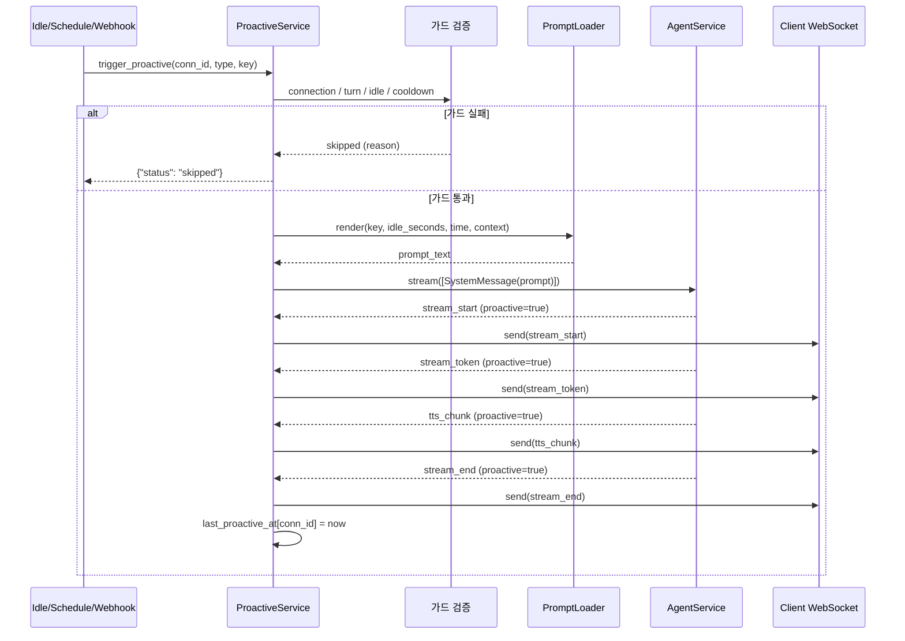

# Proactive Trigger Data Flow

Updated: 2026-04-15

## 1. Synopsis

- **Purpose**: 3가지 트리거 경로(`idle`, `schedule`, `webhook`)가 `ProactiveService.trigger_proactive()`를 거쳐 agent 응답을 WebSocket으로 직접 전송하는 흐름
- **I/O**: Idle watcher / Cron schedule / POST `/v1/proactive/trigger` → `stream_start` · `stream_token` · `tts_chunk` · `stream_end` → Client WS

## 2. Core Logic

### 2-1. 트리거 경로

| 경로 | 진입점 | trigger_type | prompt_key |
|------|--------|-------------|------------|
| **Idle Watcher** | `IdleWatcher.scan_once()` | `"idle"` | `"idle"` (기본) |
| **Schedule Manager** | `ScheduleManager._on_schedule_fire()` | `"scheduled"` | YAML에서 명시 |
| **Webhook** | `POST /v1/proactive/trigger` | 요청 body | 요청 body (선택) |

### 2-2. 공통 가드 (trigger_proactive)

모든 트리거는 동일 검증 파이프라인을 통과:

```
1. Connection 존재 + closing 아님
2. Active turn 없음 (_current_turn_id is None)
3. Idle 재확인 (idle 트리거만) — last_user_message_at < timeout
4. Cooldown — last_proactive_at + cooldown_seconds 경과
```

가드 통과 실패 시 `{"status": "skipped", "reason": "..."}` 반환.

### 2-3. Prompt → Agent → WS

```
trigger_proactive():
  PromptLoader.render(key, idle_seconds, current_time, context)
    └─ proactive_prompts.yml에서 템플릿 로드 + 변수 치환
  AgentService.stream([SystemMessage(prompt_text)])
    └─ session_id=connection_id, persona_id=conn.persona_id, agent_id="proactive"
  for event in agent_stream:
    event["proactive"] = True          # FE가 proactive 메시지 식별용
    websocket.send_text(json.dumps(event))
  last_proactive_at[connection_id] = now
```

**중요**: 일반 chat turn과 달리 `MessageProcessor`를 거치지 않음. Agent stream을 직접 WS로 전송하므로 `event_handlers.py` 파이프라인(tts_chunk 생성, token_queue, event_queue)이 **개입하지 않는다**. TTS chunk는 agent_service 내부에서 생성되어 그대로 전달됨.

### 2-4. Idle Watcher 동작

```
IdleWatcher._loop():
  every watcher_interval_seconds (기본 30s):
    scan_once():
      for each authenticated connection:
        idle_seconds = now - conn.last_user_message_at
        if idle_seconds >= idle_timeout_seconds (기본 300s):
          if connection not in triggered_connections:
            triggered_connections.add(connection_id)
            trigger_fn(connection_id, trigger_type="idle", idle_seconds=N)
```

- `triggered_connections` set: 동일 connection 중복 트리거 방지
- `reset_connection()`: 유저 메시지 발생 시 호출되어 triggered set에서 제거
- `persona_overrides`: per-persona idle_timeout 적용 (예: yuri=3s for E2E)

## 3. 전체 시퀀스



## 3. Usage

### Webhook Trigger

```bash
curl -X POST http://localhost:5500/v1/proactive/trigger \
  -H "Content-Type: application/json" \
  -d '{"session_id": "<uuid>", "trigger_type": "manual", "prompt_key": "greeting"}'
```

### YAML Config

```yaml
# yaml_files/services.yml
proactive:
  idle_timeout_seconds: 300
  cooldown_seconds: 600
  watcher_interval_seconds: 30
  persona_overrides:
    yuri: 300
  schedules:
    - id: morning_greeting
      cron: "0 9 * * 1-5"
      prompt_key: morning
      enabled: true
```

---

## Appendix

### A. 주요 구현 파일

| 파일 | 역할 |
|------|------|
| `src/services/proactive_service/proactive_service.py` | orchestrator, trigger_proactive |
| `src/services/proactive_service/idle_watcher.py` | periodic idle scan |
| `src/services/proactive_service/schedule_manager.py` | APScheduler cron jobs |
| `src/services/proactive_service/prompt_loader.py` | proactive_prompts.yml 템플릿 |
| `src/services/proactive_service/config.py` | ProactiveConfig, ScheduleEntry |
| `src/api/routes/proactive.py` | POST /v1/proactive/trigger |

### B. 일반 Chat vs Proactive 차이

| | 일반 Chat | Proactive |
|--|----------|-----------|
| 진입점 | WS `chat_message` | Idle/Schedule/Webhook |
| MessageProcessor | 사용 (event_handlers 파이프라인) | **사용 안 함** |
| TTS chunk 생성 | `event_handlers.py` (TextChunkProcessor → TTSTextProcessor) | AgentService 내부 |
| event["proactive"] | False | True |
| session_id | 사용자 지정 | connection_id |

### C. PatchNote

2026-04-15: 최초 작성. PR #38 (feat/proactive-talking) 기반.
