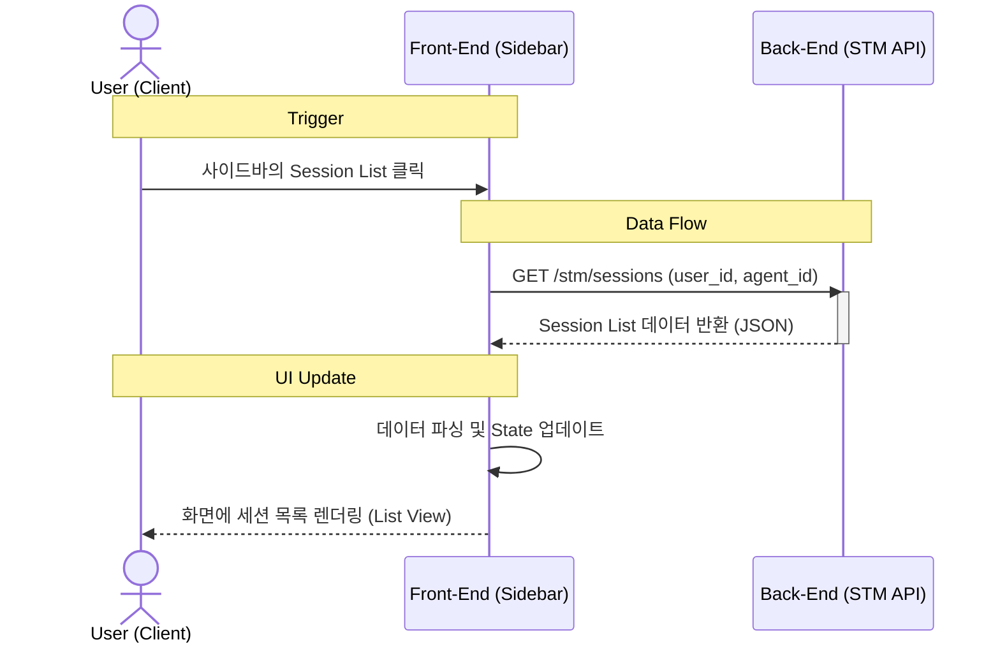

# Session List 데이터 플로우

## DATA FLOW DIAGRAM

```mermaid
sequenceDiagram
    actor User as User (Client)
    participant FE as Front-End (Sidebar)
    participant BE as Back-End (STM API)

    Note over User, FE: Trigger
    User->>FE: 사이드바의 Session List 클릭

    Note over FE, BE: Data Flow
    FE->>BE: GET /stm/sessions (user_id, agent_id)
    activate BE
    BE-->>FE: Session List 데이터 반환 (JSON)
    deactivate BE

    Note over FE, User: UI Update
    FE->>FE: 데이터 파싱 및 State 업데이트
    FE-->>User: 화면에 세션 목록 렌더링 (List View)
```

## Appendix

- [ListChatHistory API](../../../../backend//docs/api/STM_ListChatHistory.md)
- [API Service](../../feature/service/api-service.md)
