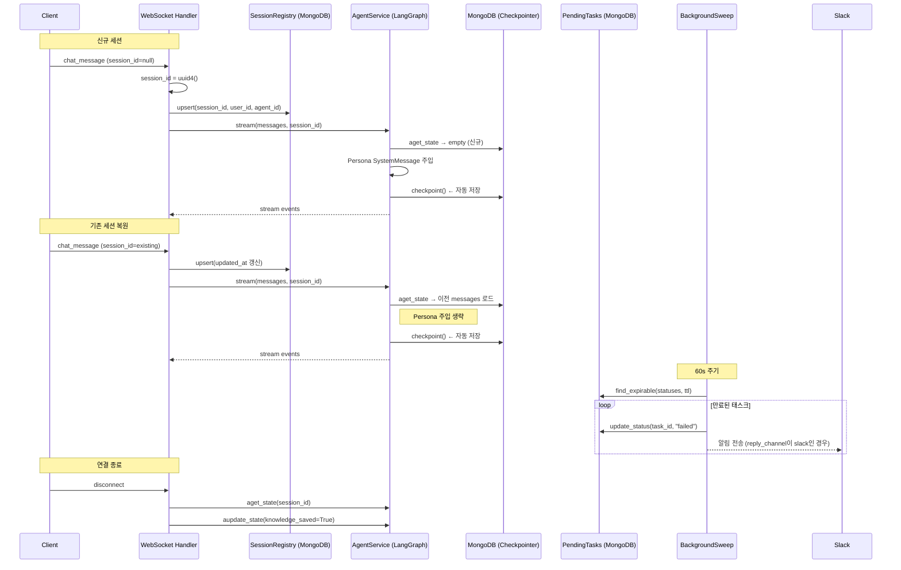

# STM Lifecycle Data Flow

Updated: 2026-04-14

## 1. Synopsis

- **Purpose**: Short-Term Memory(대화 이력) 생성·복원·만료·정리 전체 라이프사이클
- **I/O**: `session_id` (UUID) ↔ MongoDB (LangGraph checkpointer + session_registry + pending_tasks)
- **핵심**: `session_id` = LangGraph `thread_id` — 모든 STM 작업의 기준 키

## 2. Core Logic

### 2-1. 세션 생성 / 복원

```
handle_chat_message(session_id):
  if session_id is None:
    session_id = str(uuid4())        # 신규 세션
  registry.upsert(session_id, user_id, agent_id)
    └─ MongoDB session_registry: {thread_id, user_id, agent_id, created_at, updated_at}

agent_service.stream(messages, session_id):
  config = {"configurable": {"thread_id": session_id}}
  agent.astream(config=config)
    └─ LangGraph MongoDBSaver 자동 동작:
       - 기존 checkpoint 존재 → 이전 messages 전체 로드 (세션 복원)
       - 없으면 신규 state 초기화
```

**Persona 주입**: 신규 세션에만 SystemMessage로 삽입. 기존 세션 재개 시 생략.

### 2-2. 자동 저장 (Auto-Checkpoint)

`astream()` / `ainvoke()` 호출 시 LangGraph MongoDBSaver가 자동 저장. 수동 save 불필요.

```
LangGraph astream():
  ├─ LTM Retrieve Hook (before_model):
  │   └─ ltm.search_memory(query) → SystemMessage[0]에 주입
  ├─ Model Call
  ├─ Tool Calls (DelegateTaskTool 등)
  ├─ LTM Consolidation Hook (after_model):
  │   └─ 10턴마다 fire-and-forget 통합
  └─ MongoDBSaver.checkpoint() ← 자동, 매 turn 저장
```

**CustomAgentState 구조** (`state.py`):
```python
{
  "messages":   list[BaseMessage],       # 전체 대화 이력
  "user_id":    str,
  "agent_id":   str,
  "ltm_last_consolidated_at_turn": int,  # (NotRequired)
  "knowledge_saved": bool,               # (NotRequired) 중복 저장 방지
  "user_profile_loaded": bool,           # (NotRequired)
  "summary_last_consolidated_at_turn": int,  # (NotRequired)
}
```

> **Note (PR #30)**: `pending_tasks`가 LangGraph state에서 분리되어 별도 MongoDB 컬렉션(`pending_tasks`)으로 이전됨. 이제 `PendingTaskRepository`를 통해 직접 접근.

### 2-3. 백그라운드 Sweep (만료 처리)

60초마다 실행. pending_tasks TTL = 300초.

```
BackgroundSweepService._sweep_once():
  expired = pending_task_repo.find_expirable({"pending", "running"}, ttl_seconds=300)
  for task in expired:
    pending_task_repo.update_status(task_id, "failed")
    if reply_channel.provider == "slack":
      → Slack 알림 전송
```

**Key Change (PR #30)**: O(N sessions × M tasks) 루프 → 단일 MongoDB 쿼리(`find_expirable`)로 최적화. LangGraph state 접근 제거.

### 2-4. 연결 종료 처리

```
on_disconnect(session_id):
  state = agent.aget_state(config)
  if knowledge_saved: return           # 중복 방지
  if HumanMessage count < 3: return    # 대화 없으면 스킵
  build_delegate_payload()
    ├─ turns < 30: messages 인라인 포함
    └─ turns >= 30: STM REST API URL 참조
  agent.aupdate_state({"knowledge_saved": True})
```

## 3. 전체 시퀀스



---

## Appendix

### A. 주요 구현 파일

| 파일 | 역할 |
|------|------|
| `src/services/agent_service/openai_chat_agent.py` | stream(), LangGraph agent 초기화 |
| `src/services/agent_service/state.py` | CustomAgentState |
| `src/services/agent_service/session_registry.py` | MongoDB session_registry CRUD |
| `src/services/pending_task_repository.py` | MongoDB pending_tasks CRUD + TTL (7-day) |
| `src/services/task_sweep_service/sweep.py` | 백그라운드 만료 처리 (find_expirable) |
| `src/services/agent_service/middleware/task_status_middleware.py` | before_model hook — running/recent tasks 주입 |
| `src/services/websocket_service/manager/disconnect_handler.py` | 연결 종료 처리 |
| `src/services/agent_service/middleware/ltm_middleware.py` | LTM inject/consolidate |
| `yaml_files/services.yml` | MongoDB + 서비스 통합 설정 |
| **`docs/data_flow/chat/CONTEXT_INJECTION_FLOW.md`** | **프로필 동적 주입 및 요약 압축 플로우 (Phase 7)** |

### B. MongoDB 컬렉션 구조

**session_registry** (수동 관리):
```json
{
  "thread_id": "uuid",
  "user_id": "user-id",
  "agent_id": "agent-id",
  "created_at": "ISO timestamp",
  "updated_at": "ISO timestamp"
}
```

**checkpointer collections** (LangGraph 자동 관리):
- 내부 스키마, 직접 접근 금지. `aget_state()` / `aupdate_state()` API만 사용.

### C. PendingTask MongoDB 컬렉션

**pending_tasks** (MongoDB, `PendingTaskRepository`):
```json
{
  "task_id": "string (unique)",
  "session_id": "string",
  "user_id": "string",
  "agent_id": "string",
  "description": "string",
  "status": "running | done | failed",
  "created_at": "ISO timestamp",
  "completed_at": "ISO timestamp | null",
  "result_summary": "string | null",
  "reply_channel": {"provider": "slack", "channel_id": "string"} | null
}
```

**인덱스:**
- `task_id` (unique)
- `session_id`
- `(status, created_at)` 복합 인덱스
- `created_at` TTL: `expireAfterSeconds=604800` (7일)

**상태 전이**: `running` → `done` | `failed`

### D. PatchNote

2026-04-14: PR #30 반영 — pending_tasks를 LangGraph state에서 MongoDB pending_tasks 컬렉션으로 분리. Sweep 서비스가 find_expirable 단일 쿼리 사용. CustomAgentState에서 pending_tasks 필드 제거.
2026-04-08: 최초 작성. LangGraph MongoDBSaver 기반 STM 라이프사이클 코드베이스 추적 기반.
