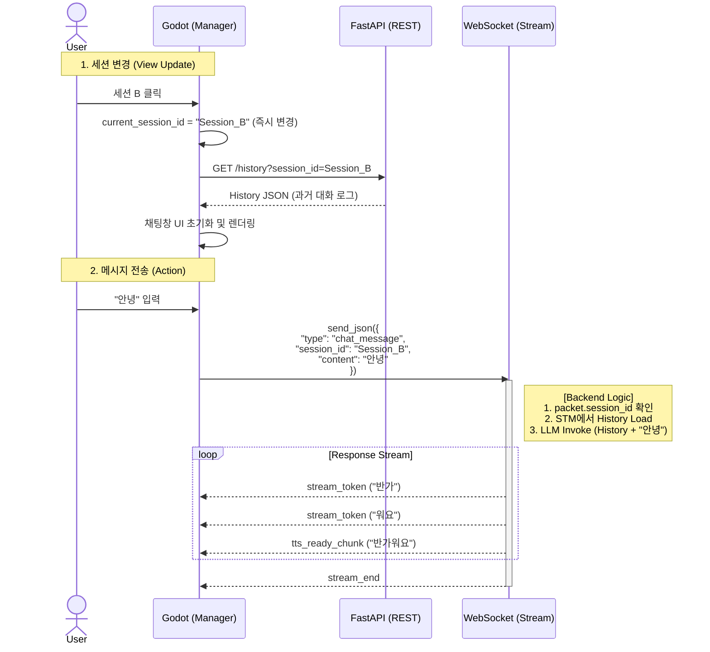

# SWITCH_SESSION 데이터 플로우

## DATA FLOW DIAGRAM

## Cautions

현재 방식에서 유일한 약점은 **"FE 변수 업데이트 타이밍"**

시나리오:

1. 사용자가 세션 A를 보고 있음.
2. 세션 B를 클릭함. (current_session_id가 B로 바뀜)
3. 하지만 네트워크가 느려서 세션 B의 History(REST)가 로딩되는 데 2초 걸림.
4. 화면엔 여전히 세션 A의 대화 내용이 남아있거나, 로딩 중임.
5. 사용자가 급해서 채팅창에 "야" 라고 치고 엔터.

이때, current_session_id는 이미 B로 바뀌었으므로, 사용자는 A의 화면을 보면서 B의 방에 "야"라고 말하게 됨

-> 해결책 (FE 구현 시 반영): 세션을 전환하는 순간(SWITCH_SESSION), REST 응답이 와서 UI가 렌더링될 때까지 채팅 입력창(Input Box)을 disabled 처리하거나, 로딩 스피너(Overlay)로 막아두기.

## Appendix

- [GetChatHistory API](../../../../backend//docs/api/STM_GetChatHistory.md)
- [ListChatHistory API](../../../../backend//docs/api/STM_ListChatHistory.md)
- [Session List 데이터 플로우](./LIST_SESSION.md)
- [API Service](../../feature/service/api-service.md)
