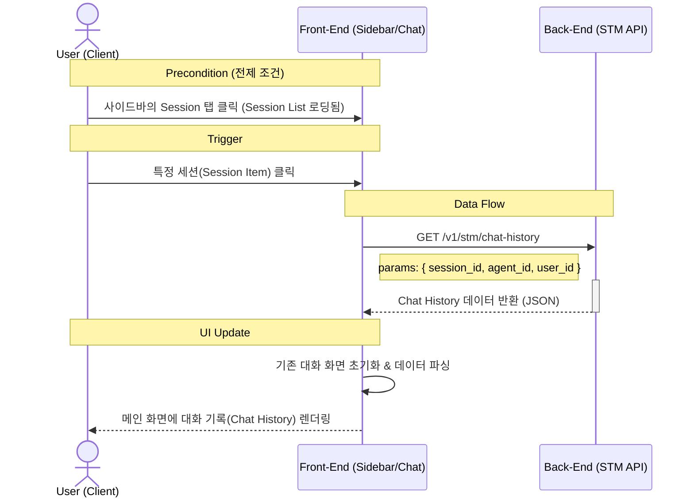

# SWITCH_SESSION 데이터 플로우

## DATA FLOW DIAGRAM

## Appendix

- [GetChatHistory API](../../../../backend//docs/api/STM_GetChatHistory.md)
- [ListChatHistory API](../../../../backend//docs/api/STM_ListChatHistory.md)
- [Session List 데이터 플로우](./LIST_SESSION.md)
- [API Service](../../feature/service/api-service.md)
