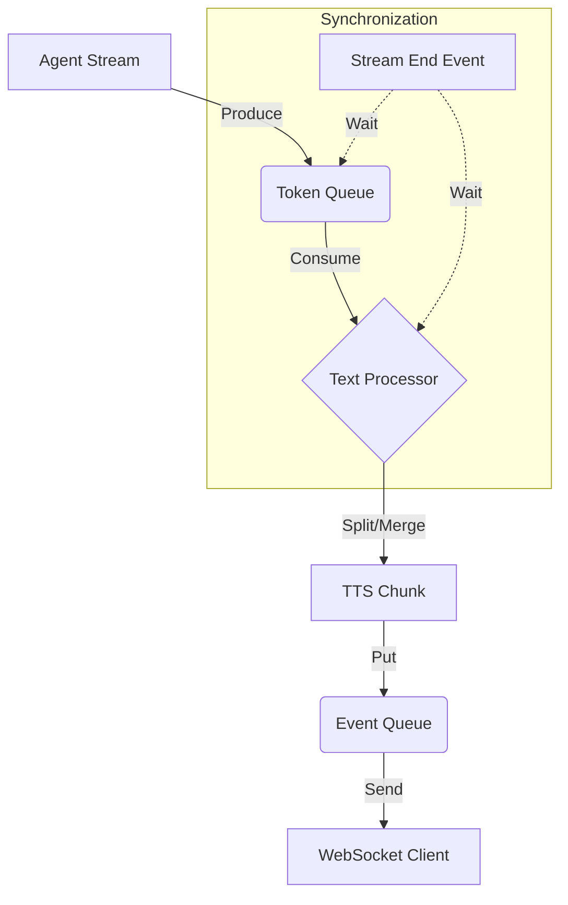

# MessageProcessor Event Flow

Updated: 2025-12-10

## 1. Synopsis

- **Purpose**: Orchestrate concurrent agent streaming and TTS generation while preventing data loss and memory leaks.
- **I/O**: `AgentService Stream` → `Token Queue` → `TTS Processing` → `Event Queue` → `WebSocket Client`

## 2. Core Logic

### 2.1 Architecture Overview

Complexity arises from the need to process text (CPU-bound) without blocking the network stream (IO-bound).



### 2.2 Critical Components

1.  **Dual Queues**
    - `token_queue`: Buffers raw tokens from LLM. Decouples fast network generation from slower text processing.
    - `event_queue`: Buffers final messages for the client. Ensures strict ordering.

2.  **Two-Phase Shutdown (The "Complicated" Part)**
    To prevent the `stream_end` event from arriving before the final TTS audio chunks:
    - **Step 1**: Producer sends `SENTINEL` to `token_queue` and waits.
    - **Step 2**: Consumer sees `SENTINEL`, flushes pending text buffers, and exits.
    - **Step 3**: Producer observes consumer exit, *then* emits `stream_end`.

3.  **Automatic Resource Management**
    - **Memory**: `start_turn()` automatically triggers `cleanup_completed_turns()` to remove old turn data.
    - **Tasks**: Background tasks are tracked and cancelled automatically on interruption or timeout.

### 2.3 Text Processing Pipeline

The consumer task transforms raw tokens into speakable audio chunks:

1.  **Chunking**: Accumulates tokens until a sentence boundary (`.!?。！？`) is found.
    - *Optimization*: Merges short sentences (<10 chars) to avoid robotic audio.
2.  **Filtering**: Removes markdown, emojis, and thinking tags (`<think>...</think>`).
3.  **Flushing**: On stream end, forces processing of any remaining text (handles multiple buffered sentences).

## 3. Usage

### Standard Flow

```python
# 1. Initialize (Connection-scope)
processor = MessageProcessor(connection_id, user_id)

# 2. Start Turn (Auto-cleans old turns)
turn_id = await processor.start_turn(
    session_id="session_1",
    user_input="Hello",
    agent_stream=agent_service.stream(...)
)

# 3. Stream to Client
async for event in processor.stream_events(turn_id):
    # event is one of: stream_start, tts_ready_chunk, stream_end
    await websocket.send_json(event)
```

### Handling Interruption

```python
# Gracefully stops producer, flushes queues, and cancels tasks
await processor.interrupt_turn(turn_id, reason="User Cancelled")
```

---

## Appendix (Reference)

### A. Configuration (`constants.py`)

- `INTERRUPT_WAIT_TIMEOUT = 1.0`: Max seconds to wait for graceful shutdown before forced cancellation.
- `queue_maxsize = 100`: limits backpressure.

### B. Related Documents

- `src/services/websocket_service/message_processor/README.md`: Technical implementation details.
- `docs/guidelines/LOGGING_GUIDE.md`: How to debug trace ids.
