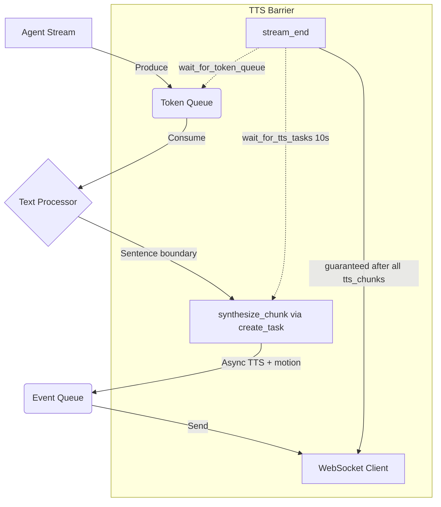

# MessageProcessor Event Flow

Updated: 2026-03-15

## 1. Synopsis

- **Purpose**: Orchestrate concurrent agent streaming, async TTS synthesis, and Unity motion data while preventing data loss and memory leaks.
- **I/O**: `AgentService Stream` → `Token Queue` → `Text Processor` → `TTS Tasks (parallel)` → `Event Queue` → `WebSocket Client`

## 2. Core Logic

### 2.1 Architecture Overview


```mermaid
graph TD
    A[Agent Stream] -->|Produce| B(Token Queue)
    B -->|Consume| C{Text Processor}
    C -->|Sentence boundary| D[synthesize_chunk via create_task]
    D -->|Async TTS + motion| E(Event Queue)
    E -->|Send| F[WebSocket Client]

    subgraph TTS Barrier
    G[stream_end] -.->|wait_for_token_queue| B
    G -.->|wait_for_tts_tasks 10s| D
    G -->|guaranteed after all tts_chunks| F
    end
```

### 2.2 Critical Components

1. **Dual Queues**
   - `token_queue`: Buffers raw tokens from LLM. Decouples fast network I/O from slower text processing.
   - `event_queue`: Buffers final messages for the client. Ensures strict ordering.

2. **Three-Phase Shutdown**
   To guarantee `stream_end` arrives after the last `tts_chunk`:
   - **Phase 1**: Producer sends `SENTINEL` → `token_queue`; consumer flushes text buffer and exits.
   - **Phase 2**: `_wait_for_tts_tasks()` awaits all outstanding TTS tasks (10s timeout).
   - **Phase 3**: `stream_end` is enqueued only after Phase 2 completes.

3. **Async TTS Pipeline (per sentence)**
   Each sentence triggers `asyncio.create_task(_synthesize_and_send(...))`:
   - Calls `synthesize_chunk()` via `asyncio.to_thread()` (non-blocking)
   - Enqueues `tts_chunk` event with audio + motion data
   - Task handle stored in `turn.tts_tasks` for the barrier

4. **Connection-Closing Guard**
   `_synthesize_and_send()` checks `is_connection_closing()` before and after synthesis.
   Orphaned tasks from disconnected clients drop silently.

5. **Automatic Resource Management**
   - `start_turn()` calls `cleanup_completed_turns()` on each new turn.
   - All tasks are tracked in `TaskManager` and cancelled on interruption/timeout.

### 2.3 Text Processing Pipeline

1. **Chunking**: Accumulates tokens until a sentence boundary (`.!?。！？`).
   - Merges short sentences (<10 chars) to avoid robotic audio.
2. **Filtering**: Removes markdown, emojis, `<think>...</think>` tags.
3. **Flushing**: Forces remaining text on stream end.
4. **TTS Dispatch**: Each flushed sentence → `create_task(_synthesize_and_send(...))` with monotonically incrementing `turn.tts_sequence`.

### 2.4 TtsChunkMessage Fields

Each `tts_chunk` event carries:

| Field | Description |
|-------|-------------|
| `sequence` | Chunk order (0-based) within the turn |
| `text` | Original sentence text |
| `audio_base64` | MP3 audio as base64, or `null` |
| `emotion` | Detected emotion tag, or `null` |
| `motion_name` | Unity AnimationPlayer motion |
| `blendshape_name` | Unity blendshape |

## 3. Usage

### Standard Flow

```python
# 1. Initialize (connection-scope) — inject TTS service and mapper
processor = MessageProcessor(
    connection_id=uuid,
    user_id="user_001",
    tts_service=get_tts_service(),
    mapper=get_emotion_motion_mapper(),
)

# 2. Start Turn — pass tts_enabled and reference_id from client message
turn_id = await processor.start_turn(
    session_id="session_1",
    user_input="Hello",
    agent_stream=agent_service.stream(...),
    tts_enabled=True,
    reference_id="aria",
)

# 3. Stream to Client
async for event in processor.stream_events(turn_id):
    # Events: stream_start, stream_token, tts_chunk (multiple), stream_end
    await websocket.send_json(event)
```

### Handling Interruption

```python
# Gracefully stops producer, flushes queues, cancels tasks
await processor.interrupt_turn(turn_id, reason="User Cancelled")
```

### TTS Disabled

```python
# tts_enabled=False → tts_chunk sent with audio_base64=null, motion still populated
turn_id = await processor.start_turn(
    session_id="session_1",
    user_input="Hello",
    agent_stream=...,
    tts_enabled=False,
)
```

---

## Appendix

### A. Configuration

- `tts_barrier_timeout_seconds: 10.0` — TTS barrier timeout before `stream_end` (YAML: `main.yml` → `websocket:`)
- `queue_maxsize: 100` — Backpressure limit on both queues

### B. Related Documents

- `src/services/websocket_service/message_processor/README.md`: Technical implementation details.
- [TTS Service](./TTS_Service.md): `synthesize_chunk()` pipeline and EmotionMotionMapper.
- [TTS Chunk WebSocket Event](../../websocket/WebSocket_TtsChunk.md): Client-facing event format.
- [Settings Fields](../config/Settings_Fields.md): WebSocket configuration.
- `docs/guidelines/LOGGING_GUIDE.md`: How to debug trace ids.
