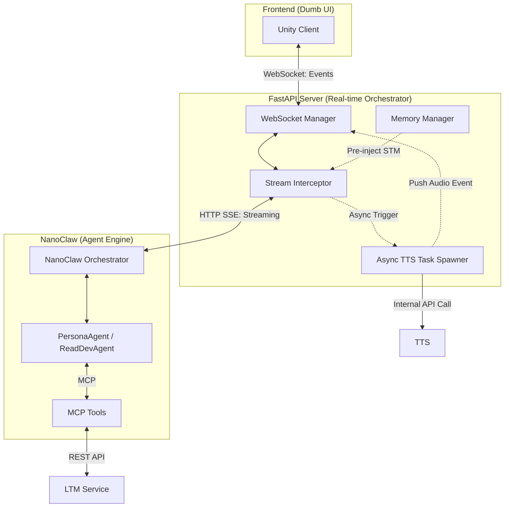

# PRD: NanoClaw Integration - Distributed Agent Architecture

Updated: 2026-03-03

## 1. Synopsis
- **Purpose**: Move agent intelligence to NanoClaw while keeping real-time UX and Dumb UI.
- **I/O**: Unity WebSocket -> FastAPI -> NanoClaw SSE -> Unity events + Backend REST via MCP.

## 2. Core Logic
- **Architecture**:
    - **FastAPI**: WebSocket gateway, session master, stream interceptor, TTS spawner.
    - **NanoClaw**: Agent execution, skills, MCP tools, channel adapters.
    - **Unity**: Render text and play audio only.
- **Contracts**:
    - **SSE events**: `token`, `tool_call`, `tool_result`, `done`, `error`, `ping`.
    - **Unity events**: `stream_start`, `text`, `audio`, `stream_end`, `clear_queue`, `system_error`, `ping`.
    - **Forwarding rule**: `tool_call`/`tool_result` never go to Unity; log only.
- **Session and turn**:
    - FastAPI creates `session_id` and `turn_id` (UUID v4).
    - Store `nanoclaw_session_id` and pass it on follow-up turns.
    - Use idempotency key for memory writes: `session_id + turn_id + role + index`.
- **Memory**:
    - STM: pre-inject last N messages per turn.
    - LTM: update every 5 turns or when tokens > 2000; run async only.
- **Streaming and TTS**:
    - Sentence boundary detection triggers async TTS tasks.
    - TTS concurrency max 3; audio queue max 20 items.
    - If queue exceeds limit, drop oldest and emit `system_error`.
- **Interrupt**:
    - On interrupt: close SSE, cancel TTS tasks, send `clear_queue`, mark turn interrupted.
- **Timeout and keepalive**:
    - First activity timeout is 5s; `ping` or `token` counts as activity.
    - NanoClaw sends `ping` every 15s.
- **Observability**:
    - Log `session_id`, `turn_id`, `nanoclaw_session_id` for every request.
    - Emit metrics: TTFT, TTS queue depth, interrupt latency, SSE error rate.
- **Roadmap (prioritized)**:
    - **M1 (P0)**: F1, F2, N1, N2, U1 (basic streaming path).
    - **M2 (P0)**: F3, F4, F5, N3, N4, U2 (TTS + interrupt).
    - **M3 (P1)**: F6, F8, N6, U3 (memory + health + resilience).
    - **M4 (P2)**: F7, N5 (migration + multi-agent Slack).
- **Team schedule (default)**:
    - **Week 1 (Mar 3-7)**: M1 complete + M2 kickoff.
    - **Week 2 (Mar 8-14)**: M2 complete + M3 kickoff.
    - **Week 3 (Mar 15-21)**: M3 complete; M4 optional if capacity allows.

## 3. Usage
- Unity sends `{type: "chat"}` -> FastAPI creates `turn_id` and `session_id`.
- FastAPI streams SSE tokens and relays `{type: "text"}` immediately.
- Completed sentences trigger async TTS -> `{type: "audio"}` with `sequence`.
- Interrupt triggers `{type: "clear_queue"}` within 50ms.

---

## Appendix (Reference & Extensions)
### A. Related Documents
- [task_fastapi/INDEX.md](task_fastapi/INDEX.md)
- [task_nanoclaw/INDEX.md](task_nanoclaw/INDEX.md)
- [task_unity/INDEX.md](task_unity/INDEX.md)

### B. Diagrams

